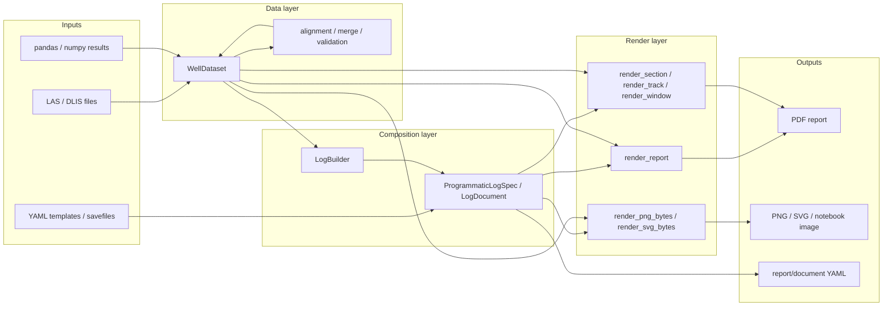

# Library Workflow

This page describes the intended end-to-end workflow of `well_log_os` as a library.

## Workflow Diagram

## Meaning Of Each Layer

### Inputs

There are two supported authoring entry points and one serialization path:

- LAS / DLIS files feed the normalized data model
- pandas / numpy results let researchers inject computed channels directly
- YAML templates / savefiles describe a layout declaratively

### Data layer

`WellDataset` is the canonical normalized data container.

At this layer, the user should be able to:

- ingest raw channels from files
- add computed channels from numpy or pandas
- validate shapes, indices, and units
- align and merge channels before rendering

This keeps research and interpretation workflows independent from page-formatting logic.

### Composition layer

Layout composition is handled separately from dataset management.

Current composition surfaces are:

- YAML templates / savefiles
- `LogBuilder` for programmatic composition

Both routes should converge on the same normalized in-memory layout objects:

- `ProgrammaticLogSpec`
- `LogDocument`

That is the key architectural boundary of the library.

### Render layer

Once data and layout are combined, the same layout can be rendered in several scopes:

- full report: `render_report(...)`
- partial section: `render_section(...)`
- single track: `render_track(...)`
- bounded window: `render_window(...)`
- notebook bytes: `render_png_bytes(...)`, `render_svg_bytes(...)`

This is what makes the library useful both for production reports and for notebook research.

### Outputs

The current output families are:

- PDF for printable log reports
- PNG / SVG bytes for notebooks and web use
- YAML serialization for saving and reloading layout definitions

## Practical Usage Model

The intended practical flow is:

1. Load or compute channels into `WellDataset`.
2. Validate, align, sort, and merge the dataset.
3. Build the layout with YAML or `LogBuilder`.
4. Render either a full report or only the part needed for analysis.
5. Save the layout definition back to YAML if needed.

## Design Rule

The library should continue to enforce this separation:

- data handling belongs in `WellDataset`
- layout handling belongs in `LogBuilder` / `LogDocument`
- rendering belongs in the backend-specific render API
- YAML is serialization, not the only authoring surface
