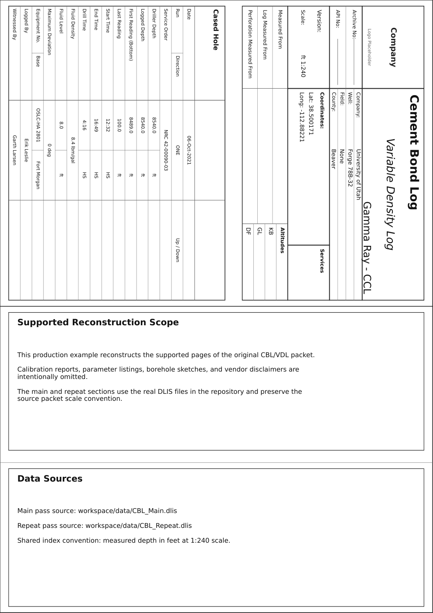
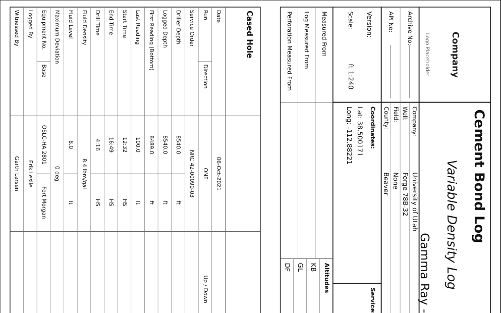
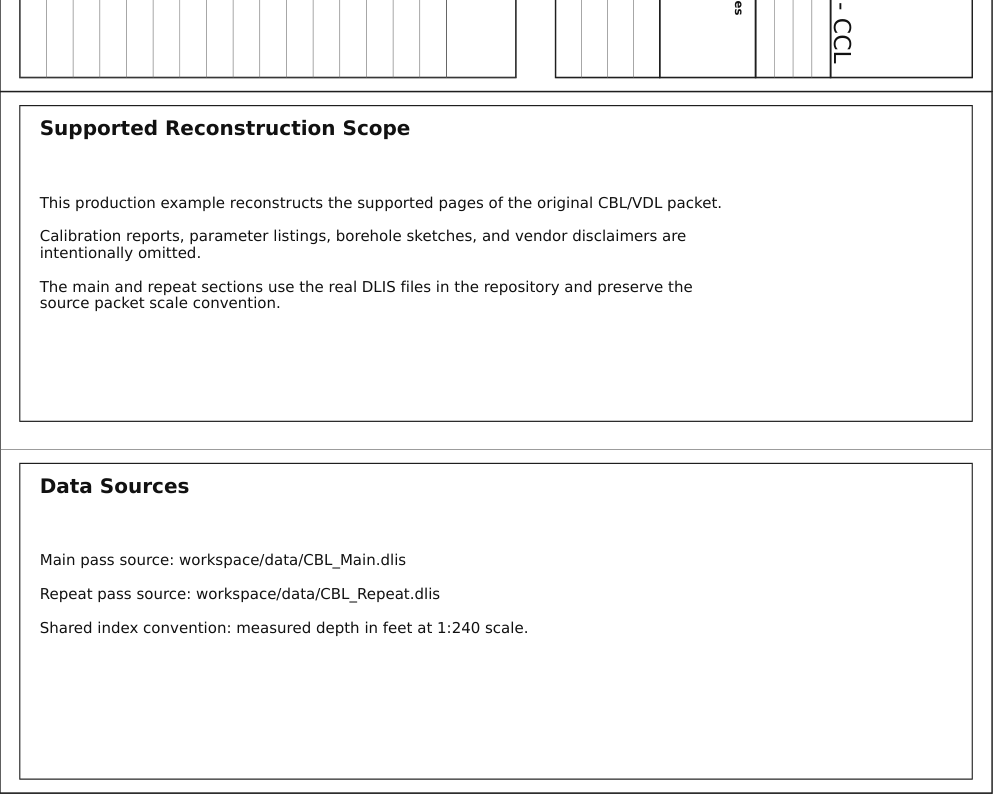
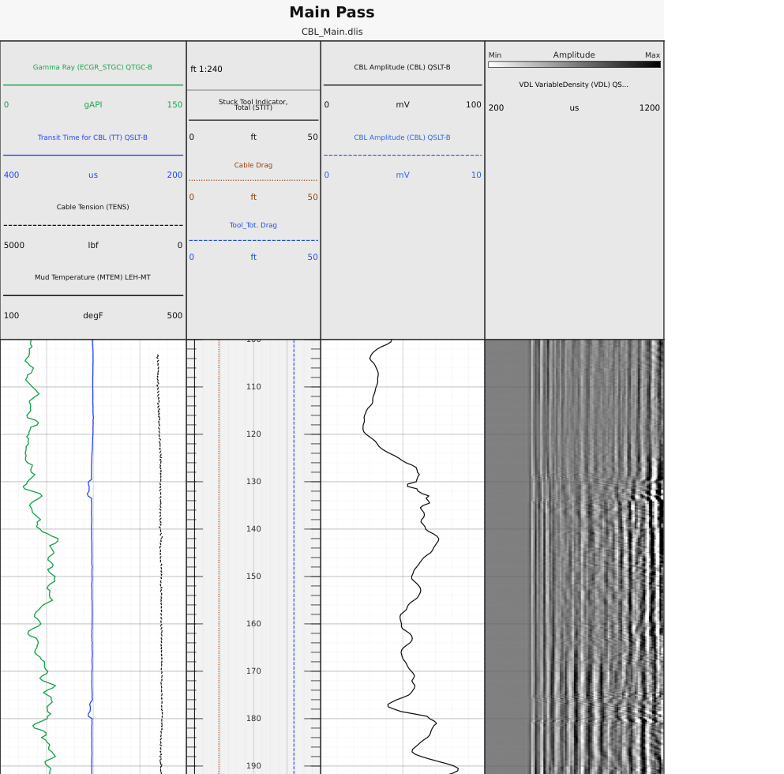
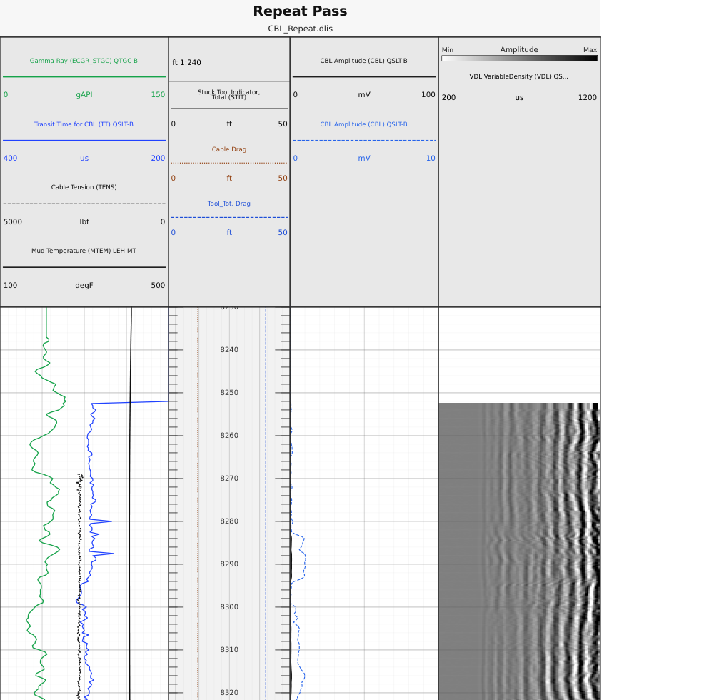
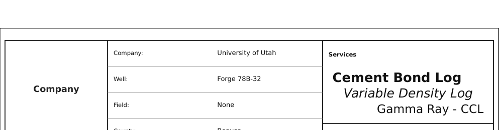

# Example 1: CBL Reconstruction

This is the first production example and the current canonical end-to-end
example in the repository.

It lives in `examples/production/cbl_log_example/` and reconstructs the
supported part of a real CBL/VDL report packet using the repo-shipped DLIS
sources below plus a reference PDF for structural comparison:

- `workspace/data/CBL_Main.dlis`
- `workspace/data/CBL_Repeat.dlis`
- `workspace/renders/CBL_log_example.Pdf` as the visual reference

The generated pages are independent `wellplot` renderings. They preserve the
factual packet structure and well metadata needed for the example without
claiming to be vendor-authored originals.

Use this example when you want one coherent packet that includes:

- a heading page
- a `remarks` block on the first page
- multiple log sections
- a layout-defining depth/reference track
- scalar curves, dual-scale CBL, and VDL raster output
- a compact tail page

## What the rendered packet looks like

{ width="760" }

The packet is built from two layers:

- `base.template.yaml`
  - shared page geometry, report styling, heading data, and tail toggle
- `full_reconstruction.log.yaml`
  - packet-specific remarks, section definitions, data sources, and bindings

That split is deliberate. Stable packet conventions belong in the template.
Section-specific content belongs in the reconstruction file.

## Package layout

The example package currently contains:

- `examples/production/cbl_log_example/README.md`
  - package overview, intended scope, and render commands
- `examples/production/cbl_log_example/base.template.yaml`
  - shared render defaults, page geometry, heading data, and tail toggle
- `examples/production/cbl_log_example/full_reconstruction.log.yaml`
  - the full packet reconstruction
- `examples/production/cbl_log_example/data-notes.md`
  - required source files and assumptions

## 1. Start with the shared template

`base.template.yaml` holds the packet-level decisions that should not vary from
section to section.

```yaml
document:
  depth_range:
    - 100
    - 8489
  page:
    size: A4
    orientation: portrait
    continuous: false
    bottom_track_header_enabled: true
    track_gap_mm: 0
    track_header_height_mm: 30
  depth:
    unit: ft
    scale: 240
    major_step: 10
    minor_step: 2
  layout:
    heading:
      enabled: true
      provider_name: Company
      general_fields:
        - key: company
          label: Company
          value: University of Utah
        - key: well
          label: Well
          value: Forge 78B-32
        - key: scale
          label: Scale
          value: ft 1:240
      service_titles:
        - value: Cement Bond Log
          font_size: 16
          auto_adjust: true
          bold: true
          alignment: left
        - value: Variable Density Log
          font_size: 15
          auto_adjust: true
          italic: true
          alignment: center
        - value: Gamma Ray - CCL
          font_size: 14
          auto_adjust: true
          alignment: right
      detail:
        kind: cased_hole
        title: Cased Hole
        rows: ...
    tail:
      enabled: true
```

This file establishes:

- the page format and scale convention
- the dedicated per-track header band
- the heading packet content
- the service-title formatting
- the fixed-row cased-hole detail table
- the fact that the packet ends with a tail page

### Heading

{ width="760" }

The heading in this example uses the shared report model documented in
[Report Pages](../reference/report-pages.md). The important split is:

- `general_fields`
  - packet identity and operational metadata
- `service_titles`
  - the large service-name stack on the cover block
- `detail`
  - the standardized `cased_hole` fixed-row table

If you are adapting this example for another packet, change these heading
fields first before touching the log sections.

## 2. Add first-page remarks and the public-data notice

`remarks` belongs in `full_reconstruction.log.yaml`, because it explains this
specific packet rather than the reusable template.

```yaml
document:
  layout:
    remarks:
      - title: Supported Reconstruction Scope
        lines:
          - This production example reconstructs the supported pages of the original CBL/VDL packet.
          - Calibration reports, parameter listings, borehole sketches, and vendor disclaimers are intentionally omitted.
          - The main and repeat sections use the real DLIS files in the repository and preserve the source packet scale convention.
        alignment: left
      - title: Data Sources
        lines:
          - "Main pass source: workspace/data/CBL_Main.dlis"
          - "Repeat pass source: workspace/data/CBL_Repeat.dlis"
          - "Shared index convention: measured depth in feet at 1:240 scale."
        alignment: left
      - title: Public Data and IP Notice
        lines:
          - This example uses publicly available or repository-provided demonstration data intended for educational use.
          - Rendered layouts are independent reproductions generated by wellplot, not vendor-authored originals or official service-company deliverables.
          - Original trademarks and service names remain the property of their respective owners.
          - Confirm data provenance and redistribution rights before reusing outputs outside this repository.
        alignment: left
```

{ width="760" }

Use `remarks` for:

- reconstruction scope
- acquisition notes
- public-data and IP notices that apply to the supported packet
- data provenance

Keep packet-wide narrative here. Do not try to encode track-specific logic in
the remarks block.

## 3. Define the log sections

The full reconstruction defines two sections:

- `main_pass`
- `repeat_pass`

Each section declares its own data source and track layout.

```yaml
document:
  layout:
    log_sections:
      - id: main_pass
        title: Main Pass
        subtitle: CBL_Main.dlis
        data:
          source_path: ../../../workspace/data/CBL_Main.dlis
          source_format: dlis
        tracks:
          - id: combo
            kind: normal
            width_mm: 50
          - id: depth
            kind: reference
            width_mm: 36
            reference:
              axis: depth
              define_layout: true
              unit: ft
              scale_ratio: 240
          - id: cbl
            kind: normal
            width_mm: 44
          - id: vdl
            kind: array
            width_mm: 48
            x_scale:
              kind: linear
              min: 200
              max: 1200
```

{ width="760" }

The important rule is that the `depth` track is the layout-defining axis:

- `kind: reference`
- `reference.define_layout: true`

Everything else aligns to that track.

In this example:

- `combo` carries GR, TT, cable tension, and mud temperature
- `depth` carries the printed depth scale and reference overlays
- `cbl` carries the dual-scale amplitude display
- `vdl` carries the array/raster display and header color bar

### Repeat section with a section-specific interval

The repeat pass uses the same structure, but it only renders the interval that
is actually present in the repeat data.

```yaml
      - id: repeat_pass
        title: Repeat Pass
        subtitle: CBL_Repeat.dlis
        depth_range:
          - 8230
          - 8490
        data:
          source_path: ../../../workspace/data/CBL_Repeat.dlis
          source_format: dlis
```

{ width="760" }

Use section-level `depth_range` when one section should render a smaller window
than the packet default.

## 4. Bind channels to tracks

The bindings layer is where the raw channels become visible elements.

This example mixes:

- normal scalar curves
- dual-scale CBL bindings
- VDL raster output
- reference-track overlays

```yaml
bindings:
  channels:
    - section: main_pass
      channel: CBL
      track_id: cbl
      kind: curve
      id: cbl_0_100_main
      label: CBL Amplitude (CBL) QSLT-B
      scale:
        kind: linear
        min: 0
        max: 100

    - section: main_pass
      channel: CBL
      track_id: cbl
      kind: curve
      id: cbl_0_10_main
      label: CBL Amplitude (CBL) QSLT-B
      style:
        color: "#2563eb"
        line_style: "--"
      scale:
        kind: linear
        min: 0
        max: 10

    - section: main_pass
      channel: VDL
      track_id: vdl
      kind: raster
      label: VDL VariableDensity (VDL) QSLT-B
      profile: vdl
      colorbar:
        enabled: true
        label: Amplitude
        position: header

    - section: main_pass
      channel: STIT
      track_id: depth
      kind: curve
      label: Stuck Tool Indicator, Total (STIT)
      scale:
        kind: linear
        min: 0
        max: 50
      reference_overlay:
        mode: indicator
        lane_start: 0.06
        lane_end: 0.20
```

Two decisions are worth copying directly:

- the CBL amplitude is bound twice so the header can expose both scales cleanly
- the stuck-tool and drag indicators live on the `depth` reference track with
  `reference_overlay`, not in a separate layout track

That second point keeps the reference track as the structural axis while still
allowing slim operational overlays.

## 5. Finish with the tail

The tail is not a second report model. It reuses the heading data and prints a
compact summary block.

{ width="760" }

In this example the tail is enabled in the shared template:

```yaml
document:
  layout:
    tail:
      enabled: true
```

That is enough because the heading and tail share the same report packet data.
See [Report Pages](../workflows/report-pages.md) for the full report model.

## Validate and render

From the repository root:

```bash
wellplot validate \
  examples/production/cbl_log_example/full_reconstruction.log.yaml

wellplot render \
  examples/production/cbl_log_example/full_reconstruction.log.yaml
```

Expected render target:

```text
workspace/renders/CBL_log_example_full_reconstruction.pdf
```

## Adapt this example safely

When you copy this example for your own packet, use this order:

1. Update `base.template.yaml`
   - company, well, service titles, detail table, scale text
2. Update `full_reconstruction.log.yaml`
   - remarks, section titles, data paths, depth windows
3. Keep the layout contract stable
   - one `reference` depth track with `define_layout: true`
4. Adjust bindings only after the tracks are settled
   - curves, raster elements, overlay lanes, fills, callouts
5. Validate before render
   - catch schema problems before spending time on visual tuning

## Why this is example 1

This example is the strongest current reference for how the main document
sections fit together:

- heading
- remarks
- log sections
- bindings
- tail

Future production examples can be narrower and more specialized. This one
remains the packet-level baseline.
