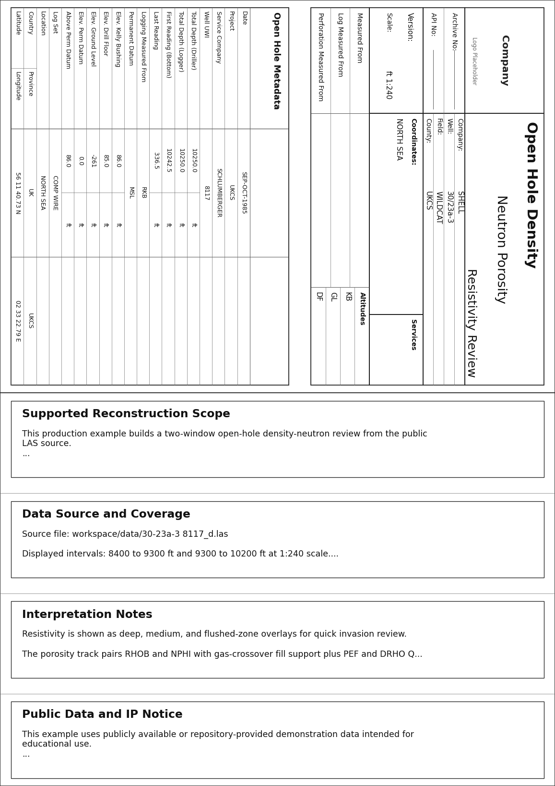
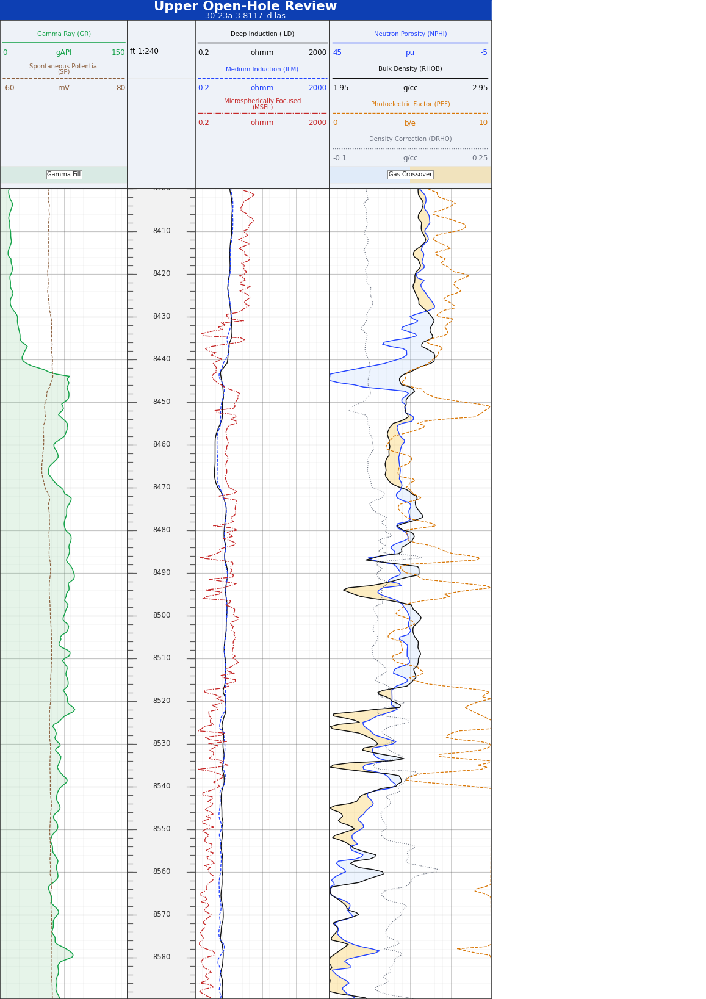
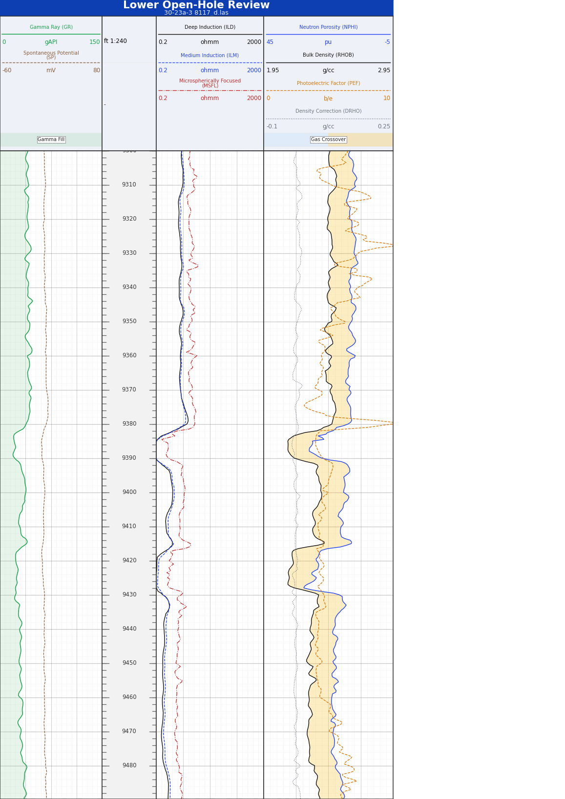
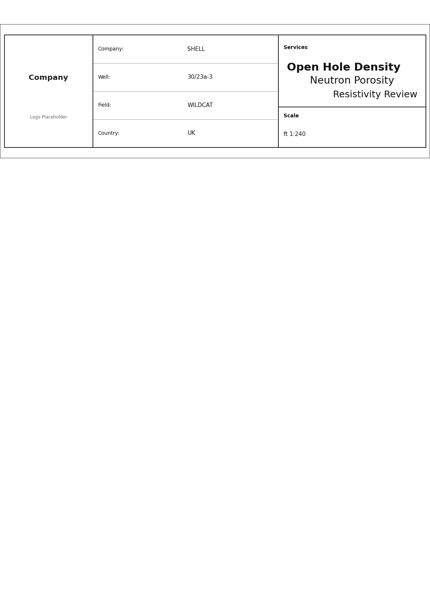

# Example 2: Porosity Reconstruction

This is the second production example and the current canonical LAS-backed
packet example in the repository.

It lives in `examples/production/forge16b_porosity_example/` and rebuilds an
open-hole report packet around one public LAS source:

- `workspace/data/30-23a-3 8117_d.las`

Unlike Example 1, this package is not a page-by-page reconstruction of a
reference vendor PDF. It demonstrates a different production task: keep a
working report template, replace the source data cleanly, and let the LAS well
header populate the packet metadata.

The generated pages are independent `wellplot` renderings. They preserve the
source-backed well metadata and curve relationships needed for the example
without claiming to be vendor-authored originals.

Use this example when you want one coherent packet that includes:

- a heading page with LAS-backed metadata
- a `remarks` block on the first page
- two open-hole review windows from the same LAS file
- resistivity overlays for deep, medium, and flushed-zone comparison
- density-neutron crossover fill plus PEF and DRHO QC curves
- a compact tail page

## What the rendered packet looks like

{ width="760" }

The packet is built from two layers:

- `base.template.yaml`
  - shared page geometry, report styling, heading definitions, and tail toggle
- `full_reconstruction.log.yaml`
  - packet-specific remarks, log sections, data sources, and curve bindings

That split is the same production pattern used by Example 1. Packet-level
layout decisions belong in the template. Source-specific scope and curve logic
belong in the reconstruction file.

## Package layout

The example package currently contains:

- `examples/production/forge16b_porosity_example/README.md`
  - package overview, intended scope, and render commands
- `examples/production/forge16b_porosity_example/base.template.yaml`
  - shared render defaults, report styling, and LAS-backed heading fields
- `examples/production/forge16b_porosity_example/full_reconstruction.log.yaml`
  - the full packet reconstruction
- `examples/production/forge16b_porosity_example/data-notes.md`
  - source-file notes, header metadata summary, and curve inventory

## 1. Start with the LAS-backed template

`base.template.yaml` holds the packet-level decisions that should not vary
between the upper and lower review windows.

```yaml
document:
  depth_range:
    - 8400
    - 10200
  page:
    size: A4
    orientation: portrait
    continuous: false
    bottom_track_header_enabled: true
    track_gap_mm: 0
    track_header_height_mm: 30
  depth:
    unit: ft
    scale: 240
  layout:
    heading:
      enabled: true
      provider_name: Company
      general_fields:
        - key: company
          label: Company
          source_key: COMP
        - key: well
          label: Well
          source_key: WELL
        - key: field
          label: Field
          source_key: FLD
      detail:
        kind: open_hole
        title: Open Hole Metadata
        rows: ...
    tail:
      enabled: true
```

This file establishes:

- the page format and depth scale convention
- the dedicated per-track header band
- the fact that heading fields resolve from LAS header keys instead of fixed
  literal values
- the standardized `open_hole` detail table
- the fact that the packet ends with a tail page

That LAS-backed `source_key` pattern is the main thing to copy from this
example when you want a report packet to follow the input file metadata instead
of hard-coded report values.

## 2. Use remarks for scope, provenance, and IP boundaries

`remarks` belongs in `full_reconstruction.log.yaml`, because it explains the
supported packet and the replacement source file rather than the reusable
template.

```yaml
document:
  layout:
    remarks:
      - title: Supported Reconstruction Scope
        lines:
          - This production example builds a two-window open-hole density-neutron review from the public LAS source.
          - Heading and report metadata are resolved directly from the LAS well header for repeatable packet generation.
          - Only curves present in the source file are plotted; vendor-only packet pages are intentionally omitted.
      - title: Public Data and IP Notice
        lines:
          - This example uses publicly available or repository-provided demonstration data intended for educational use.
          - Rendered layouts are independent reproductions generated by wellplot, not vendor-authored originals or official service-company deliverables.
          - Original trademarks and service names remain the property of their respective owners.
          - Confirm data provenance and redistribution rights before reusing outputs outside this repository.
```

Use `remarks` for:

- supported reconstruction scope
- source-file coverage notes
- interpretation framing for the packet
- public-data and IP notices that apply to the rendered output

Keep packet-wide narrative here. Do not try to encode track-specific behavior in
the remarks block.

## 3. Reuse one LAS source in two review windows

The full reconstruction defines two sections:

- `upper_review`
- `lower_review`

Each section points at the same LAS file but renders a different depth window.

```yaml
document:
  layout:
    log_sections:
      - id: upper_review
        title: Upper Open-Hole Review
        subtitle: 30-23a-3 8117_d.las
        depth_range:
          - 8400
          - 9300
        data:
          source_path: "../../../workspace/data/30-23a-3 8117_d.las"
          source_format: las

      - id: lower_review
        title: Lower Open-Hole Review
        subtitle: 30-23a-3 8117_d.las
        depth_range:
          - 9300
          - 10200
        data:
          source_path: "../../../workspace/data/30-23a-3 8117_d.las"
          source_format: las
```

{ width="760" }

{ width="760" }

This is the production pattern to copy when one source file supports multiple
review intervals:

- keep one stable track layout contract
- vary the section title and `depth_range`
- reuse the same source path cleanly instead of duplicating data files

As in Example 1, the `depth` track remains the layout-defining reference axis
for each section.

## 4. Bind resistivity overlays and density-neutron crossover fill

The bindings layer is where the replacement LAS curves become a readable
petrophysical packet.

This example mixes:

- GR and SP in the left overview track
- deep, medium, and flushed-zone resistivity overlays in one log-scale track
- NPHI and RHOB in one porosity track with a crossover fill
- PEF and DRHO as supporting QC curves in the same porosity track

```yaml
bindings:
  channels:
    - section: upper_review
      channel: ILD
      track_id: resistivity
      kind: curve
      label: Deep Induction (ILD)
      scale:
        kind: log
        min: 0.2
        max: 2000

    - section: upper_review
      channel: ILM
      track_id: resistivity
      kind: curve
      label: Medium Induction (ILM)

    - section: upper_review
      channel: NPHI
      track_id: porosity
      kind: curve
      id: nphi_overlay
      label: Neutron Porosity (NPHI)
      scale:
        kind: linear
        min: -5
        max: 45
        reverse: true
      fill:
        kind: between_instances
        other_element_id: rhob_overlay
        label: Gas Crossover
        crossover:
          enabled: true
          left_color: "#bfdbfe"
          right_color: "#fbbf24"
```

Two decisions are worth copying directly:

- the resistivity track keeps ILD, ILM, and MSFL on the same log scale so the
  invasion relationship reads immediately
- the porosity track uses `between_instances` between `NPHI` and `RHOB`, with
  crossover colors enabled, instead of a simple density-baseline fill

That second point is the distinctive part of this example. It is designed to
show density-neutron crossover behavior or gas response, while PEF and DRHO
remain in the same track as companion QC curves.

## 5. Finish with the tail

The tail is enabled in the shared template, so the packet closes with a compact
summary built from the same report data model as the heading.

{ width="760" }

```yaml
document:
  layout:
    tail:
      enabled: true
```

That is enough because the heading and tail share the same report packet data.
See [Report Pages](../workflows/report-pages.md) for the full report model.

## Validate and render

From the repository root:

```bash
uv run python -m wellplot.cli validate \
  examples/production/forge16b_porosity_example/full_reconstruction.log.yaml

uv run python -m wellplot.cli render \
  examples/production/forge16b_porosity_example/full_reconstruction.log.yaml
```

Expected render target:

```text
workspace/renders/30-23a-3_8117_porosity_reconstruction.pdf
```

## Adapt this example safely

When you copy this example for your own packet, use this order:

1. Update `base.template.yaml`
   - heading `source_key` mappings, service titles, detail-table rows, and
     packet styling
2. Update `full_reconstruction.log.yaml`
   - remarks, section titles, source path, and depth windows
3. Keep the layout contract stable
   - one `reference` depth track with `define_layout: true`
4. Adjust bindings only after the tracks are settled
   - resistivity overlays, porosity curves, fills, and QC channels
5. Validate before render
   - catch schema problems before spending time on visual tuning

## Why this is example 2

Example 1 is still the strongest reference for full packet composition across a
reference-driven CBL/VDL report. Example 2 is the narrower template-retention
reference for open-hole LAS workflows.

Use Example 2 when the real task is:

- keep a report packet shape that already works
- swap in a new public LAS source
- let the LAS header repopulate the packet metadata
- preserve meaningful resistivity and porosity interpretation cues
