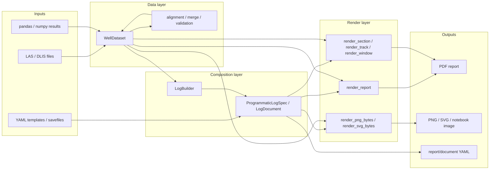

# well_log_os

`well_log_os` is a Python library for building printable well-log layouts from LAS, DLIS, and in-memory scientific data.

It is designed for two equally important workflows:

- declarative log authoring with YAML templates/savefiles
- programmatic log authoring from Python, including notebooks and research pipelines

## Library Workflow

## What You Can Do

- ingest LAS and DLIS data into normalized datasets
- add computed channels from `numpy` and `pandas`
- align, sort, convert, and merge channels before rendering
- build layouts with YAML or with the Python API
- render full reports, sections, tracks, and bounded windows
- generate PDF reports and notebook-friendly PNG/SVG outputs
- serialize layout/report definitions back to YAML

## Start Here

- Read [Getting Started](getting-started.md)
- Install the package from [Installation](installation.md)
- Learn the core objects in [Concepts](concepts.md)
- Choose a [YAML Workflow](workflows/yaml-workflow.md) or a [Python API Workflow](workflows/python-api.md)
