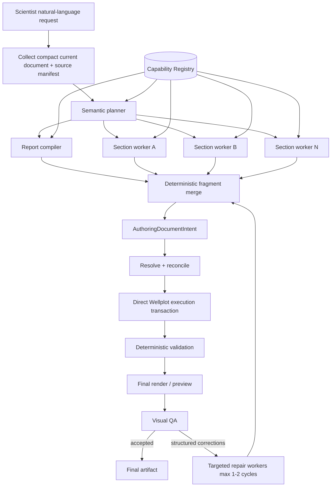
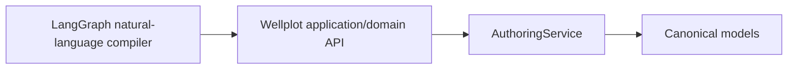
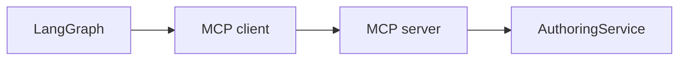
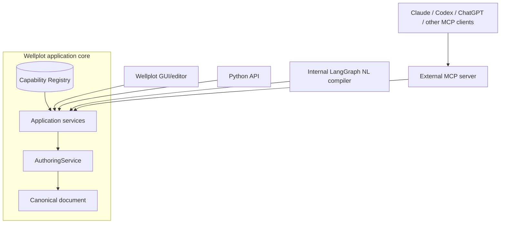
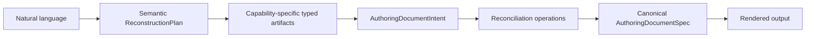
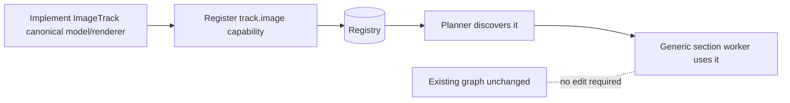
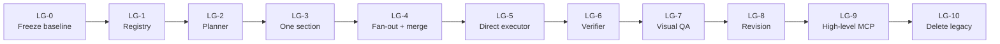
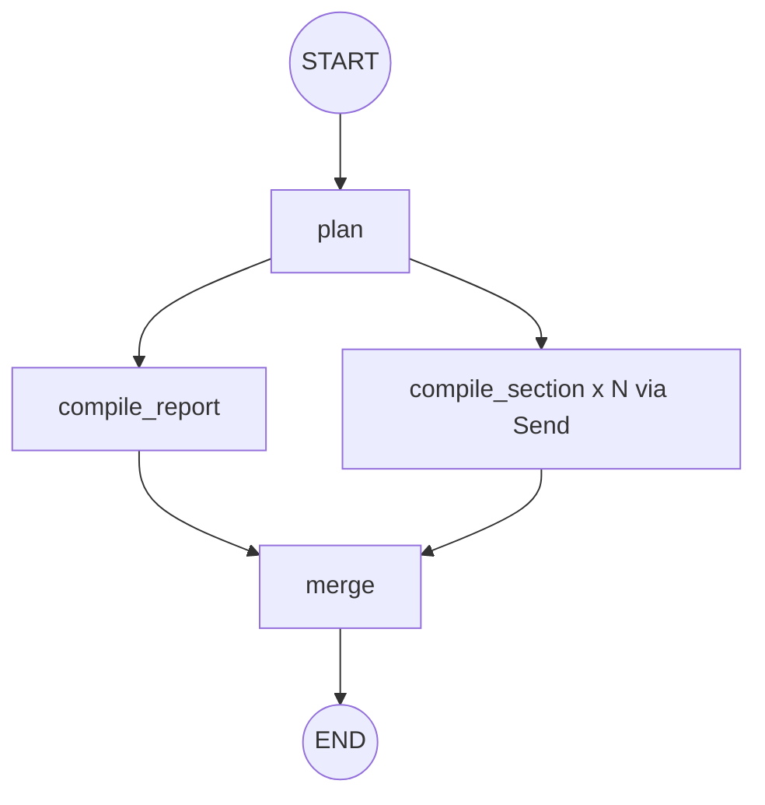

# Wellplot Agentic Natural-Language Architecture

**Status:** Proposed target architecture and staged migration plan
**Date:** 2026-08-27
**Audience:** Wellplot maintainers, Codex coding agents, reviewers, future plugin authors
**Primary objective:** Replace fragile long-horizon MCP tool inference with a modular natural-language compiler that can grow as Wellplot gains new scientific visualization capabilities.

---

## 1. Executive decision

Wellplot should pivot from a monolithic, long-running tool-calling agent to a **typed compiler pipeline coordinated by LangGraph**.

The new internal authoring path should be:

1. understand the scientist's natural-language request;
2. discover the Wellplot capabilities currently installed;
3. produce a semantic document plan;
4. fan that plan out into independently compilable section work units;
5. compile each section into typed desired state;
6. merge the typed fragments deterministically;
7. reconcile the desired state against the current canonical Wellplot document;
8. execute through Wellplot's application/domain layer directly;
9. validate structurally and against source data;
10. render a final preview;
11. optionally use a bounded visual-QA/repair stage.

**MCP remains valuable, but it moves outside the internal reasoning architecture.** It becomes an interoperability/interface layer for external AI clients rather than the mandatory internal path between Wellplot's own LLM orchestration and its domain service.

This design is driven by two product requirements:

1. **Natural-language freedom.** Scientists should be able to request arbitrary well-log layouts and combinations in natural language, constrained only by the capabilities actually installed in Wellplot—not by a fixed set of prompt templates or pre-programmed workflows.
2. **Modular growth.** Adding a capability such as a borehole-image track or a well-diagram section should not require rewriting the planner, LangGraph topology, or agent pipeline. A new capability should register its semantics, schema, compiler/executor hook, and validation behavior, then become discoverable automatically.

The architectural shorthand is:

> **LangGraph coordinates the compiler. Capabilities describe what Wellplot can do. Pydantic/canonical models define truth. Wellplot executes deterministically. MCP exposes the system externally.**

---

## 2. Why change now

The existing MCP stabilization work produced important improvements and should not be discarded. In particular, the recent work made the data plane much healthier:

- compact tool results;
- improved canonical round-trip invariants;
- structural/data/render validation separation;
- stronger MCP input/output contracts;
- deterministic rollback;
- real wire-level contract tests;
- a working one-shot CBL reconstruction baseline.

However, the successful CBL reconstruction required roughly eighty autonomous MCP decisions. Each local contract repair moved the failure to a new operation family because the underlying problem is not merely one malformed schema: the single agent must carry too many simultaneously active constraints across a long ReAct-style trajectory.

The August 27 review bundle still shows a large orchestration surface:

| Module | Approximate lines in review bundle |
|---|---:|
| `src/wellplot/agent/core.py` | 8,766 |
| `src/wellplot/agent/compilation.py` | 1,374 |
| `src/wellplot/agent/branch_compiler.py` | 427 |
| `src/wellplot/agent/operation_executor.py` | 624 |
| `src/wellplot/agent/reconciliation_bridge.py` | 518 |
| `src/wellplot/mcp/stable.py` | 1,930 |
| `src/wellplot/mcp/service.py` | 9,759 |

More important than line count, the project currently contains multiple partially overlapping ways to plan and execute authoring:

- the stable MCP feedback loop;
- request inventory and scoped compilation;
- direct-operation compilation;
- desired-state workflow;
- branch compilation;
- reconciliation;
- fallback and recovery logic.

The new architecture should **converge these concepts**, not wrap them all in LangGraph and leave them alive forever.

---

## 3. Product goals and precise interpretation of “without restrictions”

### 3.1 Natural-language authoring goal

The scientist-facing target is:

> A scientist can describe a well-log document in ordinary domain language, combine any installed visualization primitives, revise it conversationally, and receive a valid rendered Wellplot document without understanding YAML, MCP tools, stable IDs, or internal operation ordering.

Examples include:

- “Build a CBL/VDL presentation for main and repeat passes; put gamma ray and CCL on the left, amplitude and travel time together, and use a VDL raster on the right.”
- “Add a second porosity section below the first one, share the depth scale, keep the existing curves, and display neutron-density crossover fill.”
- “Place the FMI image beside caliper and gamma ray, reverse the image orientation, and add a well construction diagram showing the casing strings and perforations.”

### 3.2 What “without restrictions” should mean technically

It should **not** mean that the model may invent unsupported renderers or arbitrary internal fields.

It should mean:

> The user may express arbitrary compositions and layouts of the capabilities currently installed in Wellplot. The orchestration pipeline itself does not contain a whitelist of supported scientific use cases.

The capability registry is the boundary between natural-language freedom and implementation truth.

If `track.image` is installed, the planner can use it.

If `section.well_diagram` is installed, the planner can use it.

If neither is installed, the planner must surface an unresolved requirement rather than hallucinating support.

---

## 4. Architectural principles

These are hard constraints, not preferences.

### 4.1 The graph must be domain-agnostic

The LangGraph topology must not contain conditions such as:

```python
if request_is_cbl:
    ...

if section_type == "well_diagram":
    ...

if track_type == "image":
    ...
```

The graph knows generic stages only:

- plan;
- compile report;
- compile section;
- merge;
- resolve/reconcile;
- execute;
- validate;
- render;
- QA;
- bounded repair.

### 4.2 Capabilities, not agents, represent domain extensibility

Do not create a permanent hierarchy of `CBLAgent`, `VDLAgent`, `FMIImageAgent`, `WellDiagramAgent`, etc.

Instead register capabilities such as:

```text
section.log_plot
section.well_diagram
track.normal
track.reference
track.array
track.image
binding.curve
binding.raster
annotation.typed
fill.curve
```

Generic workers compile those capabilities.

A genuinely complex capability may provide its own compiler implementation, but selecting that compiler is a property of the capability registry—not a hard-coded LangGraph edge.

### 4.3 One source of truth for schemas

Do not maintain independent definitions in:

- Pydantic;
- YAML tool schema;
- prompt prose;
- MCP contract;
- runtime validation.

The canonical Pydantic/domain schema should drive:

- worker structured-output schemas;
- validation;
- generated documentation;
- capability descriptors;
- MCP schemas where applicable.

### 4.4 LLMs produce desired state, not mutation sequences

The LLM should answer:

> “What should this section/document be?”

not:

> “Which 27 low-level tools should I call, and in what order?”

The deterministic Wellplot layer owns the transformation from desired state to operations.

### 4.5 Parallel reasoning, serial/transactional mutation

Section compilation can fan out in parallel because workers produce isolated typed artifacts.

Workers must not concurrently mutate the same YAML/canonical document.

### 4.6 Deterministic validation before agentic QA

Structural/data validation is a deterministic application responsibility.

A visual LLM should only evaluate aspects that deterministic validation cannot establish, such as layout quality or whether a rendered figure visually matches the requested scientific presentation.

### 4.7 Bounded repair

No open-ended “agent fixes itself until it is happy” loop.

A future visual-QA stage should produce structured correction work units and permit a small configured number of repair cycles (recommended: one or two).

---

## 5. Target system architecture



The critical boundary is that the LLM-controlled part ends at typed desired state. Mutation ordering and persistence are deterministic.

---

## 6. MCP's role in the new architecture

### 6.1 MCP is not required internally

LangGraph is an orchestration framework. It can call ordinary Python functions, domain services, database APIs, or other agents directly. Wellplot's internal graph therefore does not need to serialize its own desired state into MCP calls and then deserialize those calls back into Python.

The internal target should be:



not:



The second version adds protocol translation, tool inference contracts, process/transport lifecycle, and failure modes without adding useful internal abstraction.

### 6.2 MCP should remain as an external adapter

MCP remains strategically valuable because it allows external AI hosts to control Wellplot through a standard protocol.

The intended boundary is:



MCP becomes **interface architecture**, not **reasoning architecture**.

### 6.3 Future MCP surface

Once the internal natural-language compiler is stable, the external server can expose both levels:

High-level intent tools:

```text
build_plot_from_request
revise_plot_from_request
```

Low-level expert tools:

```text
edit_section
edit_track
edit_curve_binding
...
```

A high-level MCP request can invoke the LangGraph compiler internally. Complex/long requests could later use the MCP Tasks extension, but the graph still executes through Wellplot's application layer rather than recursively tool-calling its own MCP server.

---

## 7. The compiler's intermediate representations

A scalable natural-language system needs explicit IR boundaries.



### 7.1 IR-0: Natural language

Unrestricted scientist request.

No internal IDs or operation order are required from the user.

### 7.2 IR-1: `ReconstructionPlan`

Semantic decomposition.

It answers:

- what report-wide changes are requested?
- what sections should exist?
- what is the semantic purpose of each section?
- which installed capabilities are needed?
- what explicit values or constraints did the scientist provide?
- what source hints are present?
- what dependencies exist?
- what requirements cannot currently be satisfied?

It does **not** decide exact low-level mutation order.

### 7.3 IR-2: capability artifacts

Each report/section worker returns the specific typed artifact required by its selected capability.

For the current `section.log_plot` capability, the starter uses a typed artifact wrapping `AuthoringSectionIntent`.

A future `section.well_diagram` can define a different artifact model without changing the graph.

### 7.4 IR-3: `AuthoringDocumentIntent`

This existing Wellplot model remains a valuable lower intermediate representation.

The new architecture should reuse it rather than replace it unnecessarily.

Capability compilers convert their artifacts into one or more `AuthoringDocumentIntent` fragments. A deterministic merger combines non-overlapping fragments.

### 7.5 IR-4: reconciliation operations

Existing reconciliation code decides the exact create/update/remove/move operations needed to transform the current canonical document into the desired state.

This should be deterministic.

### 7.6 IR-5: canonical document

`AuthoringDocumentSpec` is application truth.

Rendering consumes the canonical document, not provider output.

---

## 8. Capability registry design

The capability registry is the central extensibility mechanism.

A capability describes:

- stable capability ID;
- category;
- semantic description;
- human/domain aliases;
- allowed parent capabilities;
- supported source kinds;
- planning hints;
- typed worker artifact schema;
- deterministic compiler hook;
- schema/version metadata.

Conceptually:

```python
@dataclass(frozen=True)
class CapabilitySpec:
    capability_id: str
    category: CapabilityCategory
    description: str
    artifact_model: type[BaseModel]
    compiler: CapabilityCompiler
    aliases: tuple[str, ...] = ()
    allowed_parents: tuple[str, ...] = ()
    source_kinds: tuple[str, ...] = ()
    planning_hints: tuple[str, ...] = ()
```

### 8.1 Two catalogue views

Do not give every worker every schema.

The registry should expose at least two projections.

**Planner catalogue:** compact descriptions only.

```json
{
  "id": "track.array",
  "category": "track",
  "description": "Array/raster-capable track for depth-indexed matrix data.",
  "aliases": ["array track", "raster track", "vdl track"]
}
```

**Worker catalogue:** only the selected/relevant capabilities, including their schemas.

This avoids recreating the original context-bloat problem as Wellplot expands.

### 8.2 Registry invariants

- IDs are globally unique.
- Aliases cannot collide silently.
- Registration occurs during startup/plugin discovery.
- Planning output uses canonical capability IDs.
- Workers receive only scoped capability definitions.
- The graph never switches on capability IDs.

---

## 9. Extensibility example A: add an image track

Suppose Wellplot later supports a new borehole-image track.

The desired development change is local:



The plugin/module might define:

```python
class ImageTrackIntent(BaseModel):
    track_id: str
    source_channel: str
    width_mm: float
    interpolation: Literal["nearest", "bilinear"] = "bilinear"
    orientation: Literal["normal", "flipped"] = "normal"


def register(registry: CapabilityRegistry) -> None:
    registry.register(
        CapabilitySpec(
            capability_id="track.image",
            category="track",
            description="Depth-indexed borehole or other scientific image track.",
            aliases=("image track", "FMI", "OBMI", "borehole image"),
            artifact_model=ImageTrackIntent,
            compiler=compile_image_track,
            allowed_parents=("section.log_plot",),
            source_kinds=("DLIS",),
        )
    )
```

The following files should **not** change:

- LangGraph topology;
- planner implementation;
- section fan-out routing;
- report compiler;
- verifier architecture.

A test should enforce that property.

---

## 10. Extensibility example B: add a well-diagram section

A well construction/completion diagram is more structurally different from a normal log section.

That is still not a reason to change the graph.

Define a new section artifact:

```python
class WellDiagramArtifact(BaseModel):
    section_id: str
    casing_strings: list[CasingIntent]
    tubing: TubingIntent | None = None
    packers: list[PackerIntent] = []
    perforations: list[PerforationIntent] = []
```

Register:

```text
section.well_diagram
```

The capability may provide a specialized compiler that converts the artifact into the future canonical well-diagram representation.

The generic planner selects it because its descriptor explains what it does.

The same dynamic worker node receives it, loads the capability's artifact schema, and compiles it.

If the well-diagram domain becomes sufficiently specialized, the capability may select an implementation-specific compiler object. The graph still invokes the generic capability interface.

---

## 11. Planner design

The planner is the only stage that sees the complete user request and the complete *compact* capability catalogue.

### Inputs

- original natural-language request;
- compact current-document summary;
- compact source manifest;
- compact capability catalogue.

### Output

`ReconstructionPlan` only.

### Planner must not

- call MCP mutation tools;
- emit mutation sequences;
- choose service methods;
- apply defaults not supplied by the user;
- invent capabilities;
- author full detailed track objects when that work belongs to a section worker.

### Planner quality gates

Deterministic post-validation should verify:

- every capability ID exists;
- every section capability is category `section`;
- section IDs are unique;
- component IDs are unique;
- parent/child capability relationships are permitted;
- unavailable requests are surfaced as unresolved requirements.

The planner receives structured output through one typed function/schema. It should normally require one model generation plus at most one correction, not dozens of tool calls.

---

## 12. Generic section workers

The section is the recommended primary parallelization boundary because tracks, bindings, fills, raster settings and annotations must agree within a section.

A section worker receives only:

- the original request for context;
- one `SectionPlan`;
- the relevant current section state;
- relevant source channels/metadata;
- rich schemas for capabilities selected for that section.

It returns one capability-specific typed artifact.

### Why not workers by tool family?

The existing `structure / scalar / raster / annotation` split can force coordination across multiple agents for one coherent visual section.

For example:

- a track must exist before a binding;
- a raster must be placed on a compatible track;
- replicated sections need coherent IDs;
- fills depend on binding relationships.

A section worker can reason about these together and return desired state atomically.

### Why workers must not mutate directly

Concurrent workers mutating one document would create:

- stale reads;
- ID races;
- nondeterministic ordering;
- transactional ambiguity;
- hard-to-reproduce failures.

Workers compile. Wellplot mutates later in one deterministic transaction.

---

## 13. LangGraph state and fan-out

LangGraph is appropriate here because the workload mixes deterministic logic with agentic compilation and benefits from explicit state, parallel workers and future checkpointing. The official Graph API supports typed state, reducers, and map-reduce fan-out via `Send`.[LG1][LG2]

The starter state is JSON-serializable and uses list reducers for parallel worker outputs:

```python
class ReconstructionState(TypedDict, total=False):
    request: str
    current_document: dict[str, Any]
    source_manifest: dict[str, Any]
    plan: dict[str, Any]
    compiled_artifacts: Annotated[list[dict[str, Any]], operator.add]
    merged_intent: dict[str, Any]
    diagnostics: Annotated[list[dict[str, Any]], operator.add]
```

The fan-out is dynamic:

```python
return [
    Send("compile_section", {"section_plan": section, ...})
    for section in plan.sections
]
```

Reducers are necessary because parallel workers write to the same aggregate state key; LangGraph explicitly requires reducer semantics for concurrent updates.[LG1]

---

## 14. Deterministic artifact merge

Worker output is not applied directly.

Each artifact is:

1. revalidated using the capability's declared artifact model;
2. converted by the capability's deterministic compiler into an `AuthoringDocumentIntent` fragment;
3. merged with other fragments.

The merger should reject overlapping contradictory ownership.

Example:

```text
main_pass worker owns section main_pass
repeat_pass worker owns section repeat_pass
report worker owns report/header/page/depth/output
```

If two workers produce different desired state for `section_id=main_pass`, fail deterministically rather than letting “last writer wins.”

---

## 15. Direct execution without MCP

This is the major later migration slice.

Once `AuthoringDocumentIntent` is produced, use the existing deterministic application chain directly:

```text
AuthoringDocumentIntent
    -> resolve_authoring_context(...)
    -> reconcile_authoring(...)
    -> compile_reconciliation_plan(...)
    -> execute_typed_submissions(...) / AuthoringService
    -> AuthoringDocumentSpec
```

The exact bridge should be chosen based on the full repository, because the supplied expert-review bundle is intentionally incomplete and omits some imported application modules. The principle is firm: **the internal graph should not need an MCP client to call its own service.**

Transactional behavior from the current system must be preserved:

- apply to an isolated candidate service/document;
- verify operation postconditions;
- validate candidate;
- publish atomically only on success;
- retain the previous draft on failure.

---

## 16. Verification architecture

### 16.1 Deterministic verifier first

Verify at least:

- every planned section exists;
- expected stable IDs exist;
- expected source channels are bound;
- requested section/track ordering is satisfied;
- requested depth ranges/scales are satisfied;
- required raster/image capabilities are present;
- required remarks/annotations are present;
- structural validation passes;
- source/data validation passes;
- final render can be produced.

The verifier compares the original `ReconstructionPlan` plus compiled intent with final canonical state.

### 16.2 Final preview must be after final mutation

A preview generated before later repairs does not prove final visual state.

The final sequence should be:

```text
last mutation -> deterministic validation -> final render -> visual QA
```

### 16.3 Visual QA

A vision-capable model can evaluate:

- clipping;
- visually unreasonable widths;
- label collision;
- visual hierarchy;
- whether the requested presentation appears as intended.

It should return structured `VisualCorrection` objects, not prose and not direct mutations.

### 16.4 Repair routing

Corrections are routed back to the capability worker owning the affected target.

Maximum recommended repair cycles: 1-2.

---

## 17. Simple edits versus reconstruction

Do not force every request through the full graph.

During migration expose an explicit mode:

```text
mode="edit"
mode="reconstruct"
```

### Simple edit

Examples:

- “Change the subtitle.”
- “Make GR red.”
- “Increase this track to 35 mm.”

The existing stable low-level path can remain temporarily for these bounded tasks.

### Reconstruction

Examples:

- build a complete CBL presentation;
- build several passes/sections;
- combine log plots with future image/well-diagram sections;
- large natural-language revisions with many dependent components.

These use the LangGraph compiler.

**Do not add another regex complexity classifier initially.** Explicit mode prevents a new hidden router from becoming another source of inference instability.

---

## 18. Migration strategy

The migration must be **replacement-oriented**, not additive forever.

The project should end with less orchestration code, not `old core + desired-state + direct operations + MCP loop + LangGraph` all permanently supported.



### LG-0 - Freeze the behavioral baseline

**Goal:** preserve the first successful one-prompt CBL reconstruction as an acceptance oracle.

Record:

- repository commit;
- model/provider;
- prompt;
- capability/MCP contract fingerprint;
- final YAML hash;
- deterministic CBL verification output;
- final preview artifact;
- tool trace and call count.

No architecture changes until this evidence is reproducible.

**Gate:** baseline artifact and verifier committed.

---

### LG-1 - Capability registry

**Goal:** add modular capability discovery without changing request execution.

Add:

```text
src/wellplot/capabilities/base.py
src/wellplot/capabilities/registry.py
src/wellplot/capabilities/builtins.py
```

Register only existing canonical capabilities first.

Tests:

- deterministic catalog order;
- duplicate ID rejected;
- alias collision rejected;
- `track.image` mock capability can register without editing graph code;
- compact planning catalogue excludes full schemas;
- worker catalogue includes schemas only for requested capabilities.

**Gate:** no behavior change in existing notebooks.

---

### LG-2 - Semantic planner

**Goal:** natural language -> `ReconstructionPlan`; no mutation.

Reuse the existing provider abstraction through a structured-output adapter.

Evaluate CBL plan against deterministic expectations:

- expected sections;
- expected capabilities;
- expected major components;
- explicit values preserved;
- no invented unsupported capabilities.

**Gate:** planner reaches high deterministic coverage across a small benchmark set without MCP mutations.

---

### LG-3 - One section compiler

**Goal:** compile `main_pass` only into a typed artifact.

No document mutation.

Compare artifact against the known-good CBL target.

**Gate:** section intent validates and covers expected main-pass components.

---

### LG-4 - Dynamic workers and deterministic merge

**Goal:** planner fans out `main_pass`, `repeat_pass`, etc. via LangGraph `Send`; workers produce isolated artifacts; merger creates `AuthoringDocumentIntent`.

This is the first slice in the starter kit.

**Gate:** CBL `AuthoringDocumentIntent` produced in single-digit model calls and validates without MCP mutation calls.

---

### LG-5 - Direct application executor

**Goal:** remove MCP from internal reconstruction execution.

Bridge merged intent to existing resolution/reconciliation/service code.

Preserve atomic rollback semantics.

**Gate:** applying the graph-generated CBL intent produces the same or verifier-equivalent canonical document as the frozen baseline.

**Implemented:** `wellplot.agent.graph.execute_document_intent(...)` composes
the existing context resolver, reconciler, reconciliation bridge, and typed
transaction executor without MCP, provider, persistence, or rendering
dependencies. Its fixture-backed CBL evaluation verifies a successful atomic
application against a cased-hole scaffold with typed source channel metadata.
The final semantic verifier remains LG-6 work.

---

### LG-6 - Deterministic verifier

**Goal:** make successful completion a canonical fact rather than a provider claim.

Build plan-to-document postcondition checks.

**Gate:** intentionally damaged final documents fail the verifier; baseline passes.

**Implemented:** `wellplot.agent.graph.verify_document_intent(...)` is a
read-only semantic verifier. It resolves the original intent against the final
canonical document and reuses the canonical reconciler as the only comparison
authority. A result passes only when resolution is ready and reconciliation
requires no operations. Unresolved context and each remaining operation are
returned as structured verification issues; the verifier does not mutate the
document, call MCP, invoke a provider, persist files, or render output.

---

### LG-7 - Final render and visual QA

**Goal:** bounded vision-based layout review.

Add final render after final deterministic mutation. Add structured correction output and max 1-2 repair cycles.

**Gate:** visual QA cannot directly mutate canonical state; repairs route through typed capability compilers.

**Implemented:** `wellplot.agent.graph.finalize_document_intent(...)` verifies
the in-memory canonical document before invoking an injected canonical renderer.
It can pass the resulting immutable render artifact to an injected visual
reviewer, which returns only validated `VisualCorrection` objects. Failed
semantic verification prevents rendering; visual corrections are returned with
a maximum two-cycle repair budget but are not applied in this stage. The
boundary has no MCP, persistence, or provider dependency.

---

### LG-8 - Revision mode

**Goal:** same compiler handles natural-language revision against existing state.

Planner receives current document and may emit only affected sections.

**Gate:** unrelated sections are preserved without being regenerated.

**Implemented (LG-8A):** `compile_document_revision(...)` invokes the same
planner/workers/merge graph with an independent JSON-safe snapshot of the current
`AuthoringDocumentSpec` and explicit `revise` mode. Revision prompts direct the
planner to select only changed or newly requested sections, while the compiler
returns a partial `AuthoringDocumentIntent` and records both affected and
preserved section ids. A deterministic scope check rejects artifacts that
introduce sections outside the revision plan; the existing reconciliation layer
preserves omitted sections when applying the partial intent.

---

### LG-9 - High-level MCP adapter

**Goal:** expose the internal compiler externally.

Add high-level MCP operation(s) that invoke reconstruction/revision graph. Keep low-level tools for expert automation.

MCP remains a stateless/interoperable edge surface; the internal graph does not recursively use MCP. MCP 2026-07-28 explicitly moved the protocol core to a stateless request/response model and formalized extensions such as Tasks, making it appropriate as an external integration surface rather than an application-internal state machine.[MCP1]

---

### LG-10 - Deletion and consolidation

**Goal:** remove obsolete orchestration paths.

Candidates to challenge/delete once graph parity is proven:

- long stable MCP reconstruction loop as primary complex-request path;
- redundant desired-state orchestration branches;
- duplicated request classifiers;
- fallback planners superseded by capability compiler;
- branch pathways that duplicate graph worker behavior.

Do not delete deterministic domain logic merely because it currently sits in an old module.

**Gate:** production orchestration LOC materially decreases and the frozen CBL verifier remains green.

---

## 19. Starter kit delivered with this document

The starter overlay contains:

```text
src/wellplot/capabilities/
    __init__.py
    base.py
    registry.py
    builtins.py

src/wellplot/agent/graph/
    __init__.py
    models.py
    provider_adapter.py
    planner.py
    report_worker.py
    section_worker.py
    merge.py
    state.py
    workflow.py

tests/
    test_capability_registry.py
    test_graph_architecture_invariants.py
    test_reconstruction_compile_graph.py

pyproject.toml
```

The starter intentionally stops after `merged_intent`.

That is a feature, not an omission: it establishes LG-1 through LG-4 without putting the working persistence/rendering path at risk.

---

## 20. Starter graph behavior



The output is:

```python
state["merged_intent"]
```

which is a serialized `AuthoringDocumentIntent`.

No MCP mutation tools are called by this graph.

---

## 21. Provider integration in the starter

The starter does not require a LangChain model wrapper.

It defines a small interface:

```python
class StructuredModelProtocol(Protocol):
    async def generate(
        ...,
        response_model: type[BaseModel],
        ...,
    ) -> BaseModel:
        ...
```

`ExistingProviderStructuredAdapter` reuses the current `ProviderBackendProtocol.run_authoring()` implementation as a structured-output mechanism by exposing exactly one submission tool for each graph stage.

This is intentional:

- migrate orchestration first;
- keep current provider adapters initially;
- avoid simultaneously rewriting model integration and workflow architecture;
- allow future replacement with provider-native structured output without changing graph nodes.

LangChain's current structured-output architecture similarly treats structured response models as a first-class boundary and can use provider-native or tool-based structured output depending on model capabilities.[LG3]

---

## 22. LangGraph framework choices

### 22.1 Graph API, not a free supervisor

Use `StateGraph` because the topology itself is an important part of Wellplot's safety and extensibility model.

LangGraph's custom-workflow guidance explicitly positions this architecture for systems that need to combine deterministic logic, LLM nodes, branches and parallel processing.[LG4]

### 22.2 `Send` for dynamic section workers

The number of sections is request-dependent. `Send` supports map-reduce style dynamic fan-out.[LG1][LG2]

### 22.3 reducers for fan-in

Parallel worker outputs append to `compiled_artifacts` using an `operator.add` reducer. This is required to avoid ambiguous concurrent state updates.[LG1]

### 22.4 checkpointing later

Do not make persistence/checkpointing the first migration concern. Once LG-5+ is stable, LangGraph checkpointing can support resumable long jobs and human review. Official persistence support records graph state checkpoints per thread.[LG5]

### 22.5 human-in-the-loop later

Potential future interrupts:

- unresolved source/channel ambiguity;
- destructive overwrite approval;
- visual QA requiring scientist choice.

Do not insert human interrupts into the first compile-only graph.

---

## 23. Source manifest design

The planner and workers should not repeatedly inspect raw files through autonomous tools.

Create a deterministic compact source manifest once.

Suggested fields:

```text
source id/path
source format
well metadata
available depth range/unit
channels:
    mnemonic
    canonical/normalized name
    dimensions
    units
    scalar/array classification
    frame/pass identity
    aliases/description when available
```

For a section worker, filter this manifest to likely/relevant channels based on the semantic plan.

Do not pass complete DLIS metadata unless required.

---

## 24. Current-document context design

Same principle: compact projections.

Planner sees:

- report/title summary;
- section IDs/titles/types;
- major existing capabilities;
- current data sources.

Section worker sees:

- its existing target section, if any;
- dependencies it references;
- source manifest subset.

It should not see a full 40 KB canonical document unless explicitly necessary.

---

## 25. Capability plugin lifecycle

Recommended future lifecycle:

1. implement canonical model/rendering behavior;
2. implement capability artifact model;
3. implement deterministic compiler hook;
4. register capability;
5. add capability contract tests;
6. add planner discovery test;
7. add one composition benchmark;
8. optionally expose through MCP catalogue.

The planner and graph should not change.

---

## 26. Versioning capabilities

Every capability should carry a schema version.

Example:

```text
track.image@1
```

The stable ID may remain `track.image`, with `schema_version="1"` in metadata.

Version when worker artifact semantics become incompatible.

Do not encode provider/model behavior into capability versions.

---

## 27. Error taxonomy

The graph should distinguish:

### Planning error

- invalid capability selection;
- duplicate IDs;
- unsupported requested capability;
- unresolved semantic ambiguity.

### Compilation error

- section artifact invalid against capability schema;
- channel cannot be resolved;
- conflicting local constraints.

### Merge error

- two workers claim the same stable target with incompatible state;
- report worker emits section-local content.

### Execution error

- reconciliation operation invalid;
- domain invariant failure;
- persistence failure.

### Verification error

- final state does not satisfy plan;
- source/data validation fails;
- render fails.

### Visual QA error

- visual/layout issue only.

Each category should have structured diagnostics. Do not collapse every problem into another provider retry.

---

## 28. Observability and evaluation

For each reconstruction record:

```text
planner model calls
planner correction count
number of sections
worker model calls
worker correction count
capabilities selected
compiled artifact sizes
merge failures
reconciliation operation count
execution failures
validation result
visual repair cycles
wall time
token usage when available
```

The target shift should be visible numerically:

```text
old CBL path:
~80 autonomous MCP tool decisions

new path target:
1 planner call
1 report compiler call
N section compiler calls
0 LLM-selected mutation calls
optional 1 visual QA call
```

For a two-section CBL report that means roughly 4 substantive generation calls before QA.

---

## 29. Benchmark matrix

Keep at least these benchmark classes:

### A. Narrow edits

- subtitle;
- curve style;
- track width;
- remark.

### B. Single-section reconstruction

- open-hole quicklook;
- porosity panel;
- simple CBL.

### C. Multi-section reconstruction

- CBL main + repeat pass;
- multiple logging passes;
- section replication with deltas.

### D. Cross-capability composition

After future capabilities land:

- log plot + image track;
- log plot + well diagram;
- image + scalar overlay where supported.

### E. Unsupported request

Request a capability not installed. Expected behavior: unresolved requirement, not hallucinated state.

---

## 30. Code-size and architecture governance

The pivot is only successful if it reduces complexity.

Add explicit governance rules:

- graph topology contains no domain-specific capability IDs;
- new capabilities require no graph edits;
- `core.py` must not grow to integrate reconstruction graph;
- after parity, each LangGraph migration slice should delete or retire superseded orchestration code;
- no provider-specific recovery logic in graph topology;
- no regular-expression classifier deciding CBL/image/well-diagram paths;
- new graph node requires an architectural reason and benchmark;
- capability schemas, not prompts, define accepted structured output.

Suggested long-term target: `core.py` becomes a small public façade/session adapter rather than the orchestration implementation.

---

## 31. Codex operating rules

Place these rules in the task handoff or `AGENTS.md` during migration.

1. **Do not modify the LangGraph topology to support a domain capability.** Register a capability.
2. **Do not add CBL/VDL/image/well-diagram conditionals to `workflow.py`.**
3. **Do not reintroduce autonomous low-level mutation tool selection inside section workers.** Workers return typed desired state.
4. **Do not call local MCP from the reconstruction graph.** The internal executor will use application/domain APIs directly.
5. **Do not remove the working MCP path until the frozen baseline verifier passes through the graph path.**
6. **Do not rewrite the provider layer during LG-1 through LG-4.** Use the adapter.
7. **Do not solve compilation errors by adding controller heuristics.** Fix capability schema, source context, or deterministic compiler.
8. **Do not let parallel workers mutate shared state.** They may append isolated compiled artifacts only.
9. **Do not merge conflicting target ownership by last-writer-wins.** Fail deterministically.
10. **Keep capability planning descriptions compact.** Full schemas belong only in relevant worker contexts.
11. **Every migration slice must have deterministic acceptance criteria and preserve the frozen CBL baseline.**
12. **Prefer deletion after parity.** The target is consolidation, not permanent coexistence of every historical pipeline.

---

## 32. Specific instructions for applying the starter overlay

The starter overlay is deliberately additive.

### Step 1

Create a branch from the frozen working CBL baseline.

### Step 2

Copy the overlay files into the repository, preserving paths.

### Step 3

Add the optional dependency:

```toml
[project.optional-dependencies]
graph = [
  "langgraph>=1.0,<2",
]
```

Do not yet remove `mcp` from the existing `agent` extra because the legacy/simple-edit path still depends on it.

### Step 4

Run registry/invariant tests.

### Step 5

Run the existing full test suite. No existing behavior should change.

### Step 6

Use a small notebook/script to invoke only:

```python
build_compile_graph(...)
```

against a natural-language request and inspect `merged_intent`.

Do not persist it yet.

### Step 7

Build deterministic CBL intent assertions for the graph output.

Only after those pass proceed to LG-5 direct execution.

---

## 33. What the starter intentionally does not implement

- no direct persistence;
- no MCP execution;
- no visual QA;
- no repair loop;
- no automatic edit/reconstruct router;
- no image capability implementation;
- no well-diagram implementation;
- no plugin discovery mechanism beyond registry registration;
- no deletion of old orchestration code.

These omissions keep the first migration slice reviewable and reversible.

---

## 34. Expected first Codex deliverable

The first Codex task should not be “finish the LangGraph migration.”

It should be:

> Integrate the capability registry and compile-only graph overlay into the current repository. Preserve all current behavior. Add a compile-only notebook/test for the frozen CBL prompt. Demonstrate that the graph emits a valid `AuthoringDocumentIntent` containing the expected main/repeat sections using planner + report worker + section workers. Do not persist the result and do not modify the existing execution path.

Required evidence:

- all pre-existing tests pass;
- new registry tests pass;
- graph invariant test passes;
- CBL semantic planner output saved as fixture;
- CBL merged intent saved as fixture;
- model-call count recorded;
- no changes to `core.py` beyond, at most, a tiny optional entrypoint needed by the experiment;
- no MCP tool calls in the graph trace.

---

## 35. Expected second Codex deliverable

After LG-4 is green:

> Build a direct execution adapter that consumes the merged `AuthoringDocumentIntent`, reuses existing context resolution/reconciliation/typed execution, preserves transaction rollback, and returns canonical validation evidence. Do not route the graph through MCP.

This slice should include a side-by-side comparison:

```text
frozen MCP one-shot CBL canonical result
vs
LangGraph compiler + direct executor canonical result
```

Comparison should be semantic, not raw YAML byte equality where benign ordering/provenance differences are expected.

---

## 36. Long-term public API concept

Eventually:

```python
session = WellplotAuthoringSession(...)

await session.author(
    request="...",
    output="...",
    mode="reconstruct",
)

await session.revise(
    logfile="...",
    request="...",
    mode="reconstruct",
)
```

And externally through MCP:

```text
build_plot_from_request
revise_plot_from_request
```

The same internal compiler powers notebook, GUI, Python API and MCP.

---

## 37. Definition of architectural success

The migration is complete when all are true:

- full CBL reconstruction passes deterministic verification through the graph path;
- complex reconstruction no longer depends on autonomous low-level MCP tool selection;
- section compilation is dynamically fanned out;
- graph topology contains no domain capability names;
- adding a mock/new capability does not require graph code changes;
- internal execution calls Wellplot application/domain APIs directly;
- MCP remains an external interface;
- final validation and render occur after final mutation;
- visual repair is bounded;
- the number of substantive model calls is approximately O(number of sections), not O(number of low-level mutations);
- legacy orchestration code has been materially deleted or retired;
- `core.py` is shrinking toward a façade rather than accumulating new behavior.

---

## 38. References

**[LG1]** LangChain, *Use the LangGraph Graph API*. Covers state schemas, reducers, concurrent state updates and the `Send` map-reduce API.
https://docs.langchain.com/oss/python/langgraph/use-graph-api

**[LG2]** LangChain, *Workflows and agents*. Includes the orchestrator-worker pattern with parallel workers writing through reducers.
https://docs.langchain.com/oss/python/langgraph/workflows-agents

**[LG3]** LangChain, *Structured output*. Describes typed structured responses and provider/tool strategies.
https://docs.langchain.com/oss/python/langchain/structured-output

**[LG4]** LangChain, *Custom workflow*. Recommends custom LangGraph workflows when deterministic and agentic processing, branching and parallelism must be mixed.
https://docs.langchain.com/oss/python/langchain/multi-agent/custom-workflow

**[LG5]** LangChain, *LangGraph persistence*. Describes checkpoints and thread-scoped state persistence.
https://docs.langchain.com/oss/python/langgraph/persistence

**[MCP1]** Model Context Protocol maintainers, *The 2026-07-28 Specification*. Describes the stateless protocol core, cacheable discovery and formal extension framework.
https://blog.modelcontextprotocol.io/posts/2026-07-28/

---

## Appendix A - Capability checklist for future extensions

Before merging a new capability, answer:

- What stable ID identifies it?
- What aliases will scientists naturally use?
- Which category does it belong to?
- Which parent capabilities permit it?
- What source data types does it require?
- What Pydantic artifact model expresses its desired state?
- How does its deterministic compiler convert that artifact into canonical Wellplot intent/state?
- What validation rules are domain invariants?
- How does it render?
- What compact planner description is sufficient?
- Which worker schemas need to see it?
- What benchmark proves composition with existing capabilities?
- Can it be added without editing the LangGraph topology?

If the final answer to the last question is no, stop and review the abstraction before merging.

---

## Appendix B - Anti-patterns

### Anti-pattern: agent per known domain use case

```text
CBLAgent
PorosityAgent
ImageAgent
WellDiagramAgent
```

Why it fails: the orchestration graph grows with product features.

### Anti-pattern: all capabilities in every prompt

Why it fails: context grows linearly with Wellplot functionality.

### Anti-pattern: workers mutate shared YAML

Why it fails: concurrency and stale-state races.

### Anti-pattern: LLM-generated operation sequence as source of truth

Why it fails: operation ordering and retries become inference responsibilities.

### Anti-pattern: MCP as internal application bus

Why it fails: internal reasoning inherits transport/schema/tool-selection complexity with no interoperability benefit.

### Anti-pattern: last-writer-wins merge

Why it fails: conflicting worker ownership becomes silent nondeterminism.

### Anti-pattern: unbounded QA repair

Why it fails: recreates the original long feedback loop at a different level.

---

## Appendix C - Proposed package direction after migration

```text
src/wellplot/
    capabilities/
        base.py
        registry.py
        builtins.py
        sections/
            log_plot.py
            well_diagram.py          # future
        tracks/
            normal.py
            reference.py
            array.py
            image.py                 # future
        bindings/
            curve.py
            raster.py

    agent/
        graph/
            models.py
            state.py
            provider_adapter.py
            planner.py
            report_worker.py
            section_worker.py
            merge.py
            executor.py             # LG-5
            verifier.py             # LG-6
            visual_qa.py            # LG-7
            workflow.py

        core.py                     # eventually small façade

    mcp/
        ...                         # external integration surface

    authoring_service.py            # domain/application authority
    model/
        ...                         # canonical models and lower IR
```

The names may evolve, but the dependency direction should remain:

```text
capabilities / graph -> application/domain models/services
MCP -> application/domain services and optionally high-level graph API
application/domain layer -> neither LangGraph nor MCP
```
